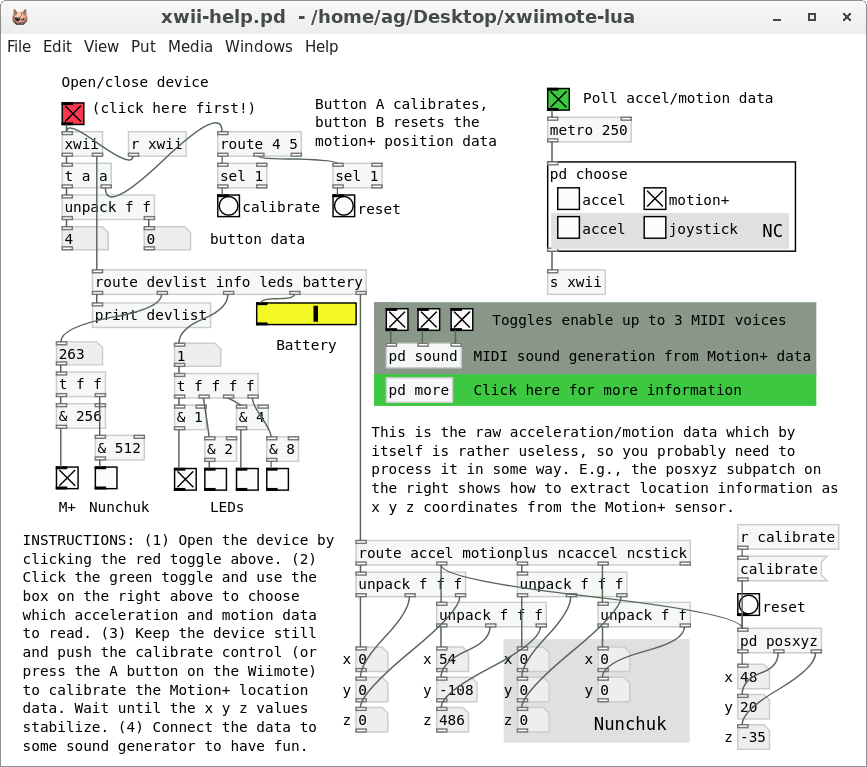

# xwiimote-lua

Easy access to the Wii Remote from Pd, using [libxwiimote](http://dvdhrm.github.io/xwiimote/). This object allows you to query the list of known devices, open a device, poll for key events and query movement (x, y, z) data. The usual extensions such as Motion-Plus and the Nunchuk are all recognized. Please check the accompanying help patch for an example showing how this external is used.

There's another external from DISIS included in Pd-l2ork which does this, but I could never get it to work with version 5 of the [Bluez](http://www.bluez.org/) stack; the user space driver and utilities used by the disis_wiimote external just don't seem to be supported any more. The xwiimote driver has been in the Linux kernel for a while now, and the corresponding user space utilities and library are readily available in many distributions. This is what the present implementation uses.

## Installation

Please note that this requires the xwiimote driver, and hence Linux. The xwii external is implemented as a [Pd-Lua](https://github.com/agraef/pd-lua) module and needs Lua 5.3, so you'll need to have that installed (it's included in the latest Pd-l2ork a.k.a. [Purr Data](https://agraef.github.io/purr-data/) versions). The Pd-Lua module in turn requires a little C wrapper around libxwiimote ([xwiilua.c](xwiilua.c), included in this package), so you need to have libxwiimote installed as well. It's most likely available in your distribution's official or contributed package repositories, otherwise you can find it at <https://github.com/dvdhrm/xwiimote>, and compile it from source.

Run `make` to compile the xwiilua wrapper. (There's no `make install` right now, so you either just use the package as is, or copy the entire shebang to some directory where Pd will find the external.) Try opening the xwii-help patch, if it launches without any errors then you should be set. If not then please review the previous paragraph and double-check that you have all the required dependencies installed, and that your Pd has the Pd-Lua extension installed and activated (check <https://github.com/agraef/pd-lua> for instructions on the latter).

## Hardware Setup

If you already paired your Wii Remote with your Linux computer and tested your hardware setup with the xwiishow utility, then you can skip this section and start kicking the tires right away with the xii-help patch. Otherwise check the instructions on the [xwiimote](http://dvdhrm.github.io/xwiimote/) website. You also need to make sure that you are in group `input` so that you can access the device as an ordinary user; please check the [XWiimote page](https://wiki.archlinux.org/index.php/XWiimote) in the Arch wiki to get that figured out.

**NOTE:** If you plan to operate the LEDs on the Wii Remote then most likely you'll need to give yourself permissions to do that. To these ends, grab the 70-udev-xwiimote.rules file from <https://github.com/dvdhrm/xwiimote> (it's in the res subdirectory of that repository) and copy it to /etc/udev/rules.d (you need to be root to be able to do that). Reboot (or run `udevadm control --reload-rules && udevadm trigger` as root) and you should be set. Note that this is only needed if you want to *change* the LEDs from your Pd patches, e.g., in order to implement some kind of light show on the device; just *reading* the LED status will work just fine without it. Funnily enough, operating the Wii Remote's force feedback (a.k.a. "rumble") will also work without jumping through these hoops.

## Usage

The xwii-help patch should tell you just about everything that you need to know. It looks like this:

Quite obviously, you're supposed to click the red toggle above the `xwii` object to open the connection to your Wii Remote. Then click the green toggle and select the acceleration and motion data that you want to see.

Make sure to also check the "more" subpatch for information on how to query auxiliary data such as the battery status, and how to operate the rumble motor and the LEDs. The "sound" subpatch does some simplistic MIDI generation from the location data derived from the Motion+ sensor. To make that work, you'll have to enable polling of the Motion+ data and connect your Pd to a suitable General MIDI synth such as Qsynth/Fluidsynth.

Note that 99% of the help patch is just about getting data into and out of that little `xwii` object which does all the real work of communicating with the device. Once the object is kicked off with a bang or a nonzero number, the device is polled at regular intervals. The object outputs key events on the first outlet when they occur. Special messages can be used to retrieve movement data and other information about the device on the second outlet. A zero on the inlet stops reporting and closes the device.

If you have more than one Wii Remote attached to your system, the number of the device to be opened can be specified as the first creation argument of `xwii`. By default, the first connected device will be used. Each device can be opened only once, so you should have at most one `xwii` object for each device in your patch.

The update period in msecs can be given as the second creation argument. Otherwise a hard-coded default of 10 msec is used (you can change that default by modifying the Lua source of the external). Note that this is only the *internal* update rate. By itself, the `xwii` object only reports key events as they happen on the first outlet, but not any motion data (there's just too much of it). In the Pd patch, you'll have to send the appropriate messages to the `xwii` object to extract that data in regular intervals (typically at a much lower rate than the 10 msec internal update interval). The "choose" subpatch shows how to do this at regular intervals with a little help from Pd's `metro` object. The data then goes to the second outlet (along with other data that is queried explicitly, so you'll use `route` to figure out what kind of data it is, as shown in the main xwii-help patch).

## Bugs

This software is 100% bug free! :) No seriously, if you want to report a bug or contribute a feature, just head over to <https://github.com/agraef/xwiimote-lua> and submit a bug report or toss me a pull request.

Enjoy! :)

Fri Apr 6 18:00:29 CEST 2018  
Albert Gräf <aggraef@gmail.com>
